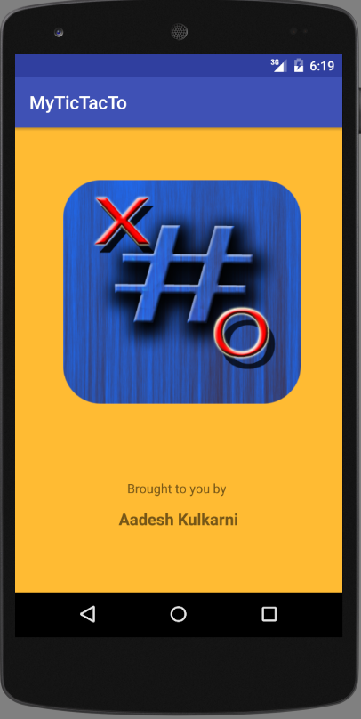
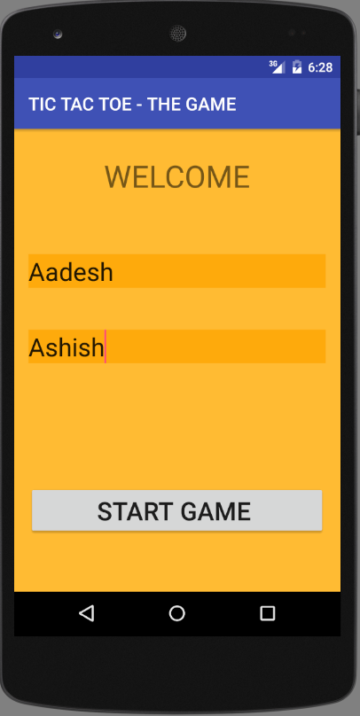
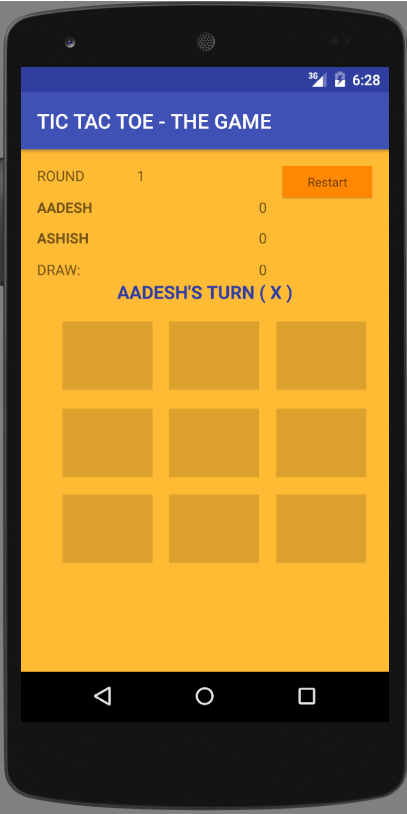
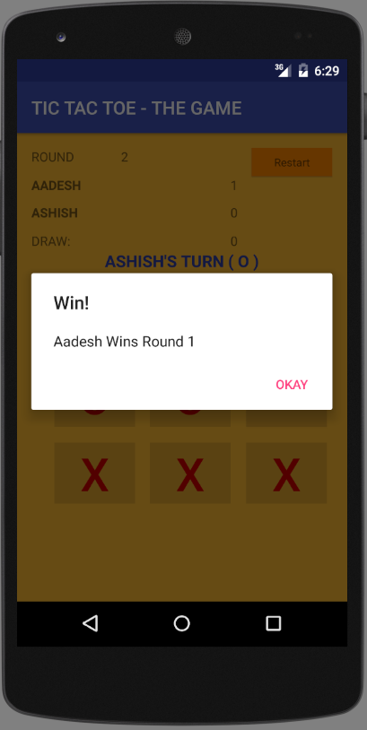

Hey Guys. 
This is my first Project on Github.

This project is <b>an Android Two-Player App</b> with simple rules covering all features in simplicity. 
Each Game has 2 Players and 5 Rounds. (Best of 5) ---// You can set the Round limit as per your wish.
After 5 Rounds, The Winner is announced and Game is restarted again. 

<b>Future Scope of this Project:</b> \\n
1. Play Againist CPU (Single Player) --- // probably need to implement MinMax BackTracking Algorithm.\\n
2. A Settings Screen (to adjust difficulty level if playing with the CPU, also number of rounds to play in each game, etc) \\n
3. Multiplayer on Wifi/Lan (Using 2 Mobile Phones)\\n
